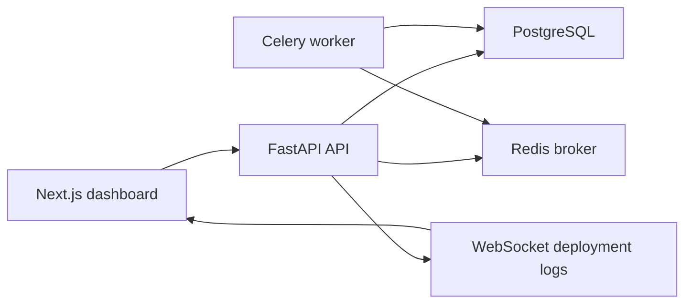
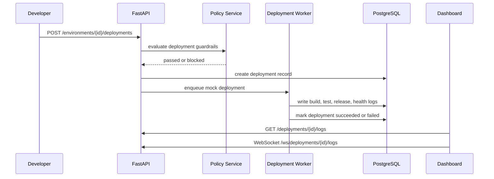
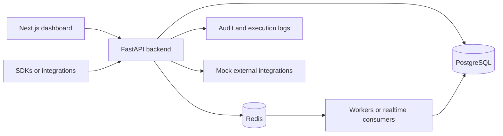
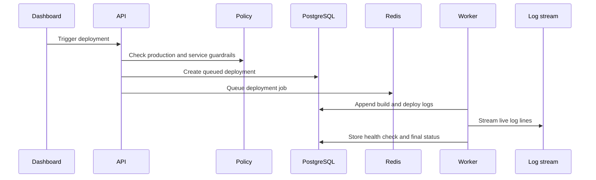

# Internal Deployment Platform

[](https://github.com/SpyloDEV/internal-deployment-platform/actions/workflows/ci.yml)


Internal Deployment Platform is a lead-level fullstack portfolio project that models a small internal version of Vercel, Railway, or Render for engineering teams. It gives developers a control plane to register services, manage environments, configure secrets, trigger mock deployments, inspect live logs, run health checks, rollback releases, review policy guardrails, and investigate incidents.

The project is built to look like a real platform engineering product, not a tutorial app. The backend uses FastAPI, PostgreSQL, SQLAlchemy 2.0, Alembic, Redis, Celery, JWT authentication, service/repository layers, and pytest. The frontend uses Next.js, TypeScript, Tailwind, shadcn-style components, TanStack Query, and Recharts.

## Screenshots

Screenshots are intentionally left as repo-ready placeholders so a portfolio owner can add their own local captures after running the app.

| Dashboard | Service Detail | Deployment Logs |
| --- | --- | --- |
| `docs/screenshots/dashboard.png` | `docs/screenshots/service-detail.png` | `docs/screenshots/deployment-logs.png` |

## Product Capabilities

- JWT authentication with register, login, logout, and current user endpoints.
- Organizations, teams, and role-based permissions for platform owners, admins, developers, and viewers.
- Service registry for frontend, backend, worker, and API services.
- Environments for development, staging, production, and preview releases.
- Mock deployment engine with queued, building, deploying, succeeded, failed, cancelled, and rolled back states.
- Stored deployment logs plus a WebSocket endpoint for realtime deployment log streaming.
- Rollback records linked to a previous successful deployment.
- Environment variables with secret masking and audit trails.
- Health checks with history and automatic service/environment status updates.
- Deployment analytics for success rate, average duration, rollout volume, failures, and rollbacks.
- Policy guardrails for production deploys, staging promotion, ownership, offline services, and secret changes.
- Incident tracking linked to services, environments, and deployments.
- Audit logs for important platform actions.

## Architecture



The backend keeps route handlers thin. Business rules live in services, database access lives in repositories, and SQLAlchemy models are separated from Pydantic schemas.

```text
backend/
  app/
    api/routes/          REST and WebSocket endpoints
    core/                config, security, exceptions, logging
    db/                  async SQLAlchemy session and base metadata
    models/              SQLAlchemy models and enums
    repositories/        database access layer
    schemas/             Pydantic request/response contracts
    services/            business logic and policy checks
    workers/             Celery app and background task entrypoints
    websockets/          connection manager
  alembic/               migrations
  tests/                 pytest suite

frontend/
  app/                   Next.js App Router pages
  components/            dashboard, layout, charts, tables, forms, ui
  hooks/                 TanStack Query hooks
  lib/                   API, auth, websocket, utility helpers
  types/                 shared frontend types
```

## Deployment Flow



## Rollback Flow

1. A user selects a previous successful deployment.
2. The API validates access and rollout state.
3. A rollback deployment record is created with `rollback_source_deployment_id`.
4. Rollback logs and an audit event are stored.
5. Analytics include the rollback in reliability metrics.

## Policy Guardrails

| Policy | Behavior |
| --- | --- |
| Production deploy requires admin | Blocks developers from production releases. |
| Staging success required | Blocks production deploys without a successful staging deployment first. |
| Owner team required | Blocks services without an owner team. |
| Offline service blocked | Blocks deploys while a service is offline. |
| Production env var audit | Emits warnings and audit logs for production changes. |

## API Examples

```bash
curl -X POST http://localhost:8000/api/v1/auth/register \
  -H "Content-Type: application/json" \
  -d '{"email":"platform@example.com","password":"SecurePass123!","full_name":"Platform Owner"}'
```

```bash
curl -X POST http://localhost:8000/api/v1/services \
  -H "Authorization: Bearer <token>" \
  -H "Content-Type: application/json" \
  -d '{
    "organization_id": "<organization_id>",
    "name": "customer-api",
    "repository_url": "https://github.com/acme/customer-api",
    "service_type": "backend",
    "framework": "fastapi",
    "status": "healthy",
    "owner_team": "Core Platform"
  }'
```

```bash
curl -X POST http://localhost:8000/api/v1/environments/<environment_id>/deployments \
  -H "Authorization: Bearer <token>" \
  -H "Content-Type: application/json" \
  -d '{"version":"v2.8.4","commit_sha":"abc123456789"}'
```

Example deployment response:

```json
{
  "id": "dep_123",
  "service_id": "svc_123",
  "environment_id": "env_123",
  "version": "v2.8.4",
  "commit_sha": "abc123456789",
  "branch": "main",
  "status": "succeeded",
  "duration_seconds": 42,
  "rollback_source_deployment_id": null
}
```

WebSocket log stream:

```text
ws://localhost:8000/api/v1/ws/deployments/{deployment_id}/logs?token=<jwt>
```

## Frontend Pages

- `/login`
- `/register`
- `/dashboard`
- `/services`
- `/services/[id]`
- `/services/[id]/environments`
- `/deployments`
- `/deployments/[id]`
- `/analytics`
- `/governance`
- `/audit-logs`
- `/incidents`
- `/settings`

## Local Setup

Backend:

```bash
cd backend
python -m venv .venv
source .venv/bin/activate
pip install -e ".[dev]"
cp ../.env.example ../.env
alembic upgrade head
uvicorn app.main:app --reload
```

Frontend:

```bash
cd frontend
npm install
npm run dev
```

The API docs are available at `http://localhost:8000/docs`.

## Docker Setup

```bash
cp .env.example .env
docker compose up --build
```

Compose starts the backend API, Next.js frontend, PostgreSQL, Redis, and a Celery worker.

## Testing and Quality

```bash
make test
make lint
make migrate
make worker
```

The GitHub Actions workflow runs Ruff, Black, pytest, frontend lint, TypeScript typecheck, and Next.js production build.

## Demo Data

```bash
cd backend
python scripts/seed_demo.py
```

Demo credentials:

```text
Email: platform@example.com
Password: SecurePass123!
```

Seed data includes a demo platform owner, organization, team, services, environments, deployments, deployment logs, masked env vars, health checks, incidents, and audit logs.

## Why This Is Lead-Level

- A real control-plane domain instead of generic CRUD.
- Permission checks at the service layer.
- Policy evaluation before dangerous actions.
- Durable deployment history and rollback records.
- Secret masking and audit logging.
- Background worker boundary for long-running release jobs.
- WebSocket log stream for realtime operations.
- Migration-ready SQLAlchemy schema.
- CI that validates backend and frontend quality gates.

## What This Demonstrates

- FastAPI application structure with clear modules.
- Async SQLAlchemy 2.0 with repository boundaries.
- Alembic migrations for production-style schema management.
- JWT authentication and role-aware access control.
- Dockerized fullstack development with PostgreSQL and Redis.
- Deployment-domain modeling: services, environments, logs, health, policies, rollbacks, incidents.
- Frontend dashboard composition with Next.js, TypeScript, Tailwind, charts, tables, states, and responsive layout.

<!-- lead-level-notes:start -->

## Lead-Level Architecture Notes

### Problem

Teams need deployment history, environment variables, live logs, health checks, rollbacks, and audit trails in one place. Without a deployment control plane, production changes are hard to review and harder to recover from.

### Solution

This platform models organizations, teams, services, environments, deployments, logs, rollbacks, env vars, health checks, policies, incidents, metrics, and audit logs. Workers simulate deployment steps while WebSockets stream build and deploy logs to the dashboard.

### Architecture Overview

This is a portfolio/simulation project, but it is structured around the same boundaries a production team would care about:

- Frontend/client: Next.js frontend.
- Backend API: FastAPI routes stay thin and delegate business rules to services.
- Database: PostgreSQL is the source of truth for relational state, ownership, and auditability.
- Redis: Used where the project needs queues, Pub/Sub, cache-ready paths, or rate-limit-ready primitives.
- Background jobs: Deployments are intentionally modeled as asynchronous jobs with status transitions, logs, cancellation points, and rollback records.
- Integrations: Mock providers are kept behind service boundaries so real vendors can be added without changing API contracts.
- Runtime flow: Requests validate identity and tenant access first, then call services that persist state, emit logs, and enqueue async work when needed.

Key components:

- Next.js deployment dashboard
- FastAPI backend API
- PostgreSQL for services, environments, deployments, logs, incidents, and audit state
- Redis broker for deployment workers
- WebSockets for live deployment logs
- Policy service for production guardrails

### Mermaid Diagrams

#### System Overview



#### Deployment Flow



### Lead-Level Engineering Decisions

- FastAPI keeps the API surface explicit, typed, and easy to document through OpenAPI.
- PostgreSQL is used for durable relational state because the core domain depends on ownership, filtering, constraints, and audit history.
- Service and repository layers keep route handlers small and make permission checks, workflows, and business rules easier to test.
- Redis is used for lightweight async coordination, Pub/Sub, cache-ready access patterns, or rate limiting depending on the product shape.
- Pydantic schemas define clear input/output contracts and avoid leaking ORM details into HTTP responses.
- Docker Compose keeps the local runtime close to a real deployment without hiding the moving parts.
- The project would need Kafka or another event stream when message volume, replay, ordering, or cross-service consumers outgrow Redis queues or Pub/Sub.
- Kubernetes would make sense once multiple API/worker replicas, autoscaling, secrets management, and rollout strategy become operational concerns.
- Object storage becomes necessary when user-uploaded files, exports, or artifacts should not live on local disk.

### Production Considerations

- Rate limiting should be applied to authentication, public ingestion, webhook, and API-key protected endpoints.
- Important POST endpoints should support idempotency keys when clients may retry after timeouts.
- Workers should record retry attempts, terminal failures, and enough context for support/debugging.
- Structured logging should include request IDs, actor IDs, tenant/workspace IDs, and resource IDs where safe.
- Health checks should distinguish process health from dependency readiness for database, Redis, and workers.
- Error responses should stay consistent and avoid leaking internal exception details.
- Pagination and filtering should be mandatory for list endpoints that can grow with customer usage.
- Validation should happen at the API boundary and again inside domain services for sensitive state transitions.
- Audit logs should be append-only from the application's point of view and easy to filter by actor/action/resource.

### Security Considerations

- JWT secrets and database credentials belong in environment variables or a secret manager, never in source code.
- Passwords should be hashed with a slow password hashing algorithm and never logged.
- API keys should be shown only once, stored hashed, scoped to the smallest useful surface, and revocable.
- RBAC or workspace membership checks should happen before returning or mutating tenant-owned resources.
- Tenant/workspace isolation should be tested with explicit cross-tenant access attempts.
- Input validation should cover request bodies, path parameters, uploaded files, and integration payloads.
- Safe defaults matter: deny by default, keep production actions stricter, and prefer explicit allow lists.
- The most important security boundary in this project is role-based deployment permissions and secret masking for env vars.

### Observability

- Request logs should capture method, path, status, latency, and correlation ID.
- Domain logs should capture state transitions such as queued, processing, completed, failed, revoked, or retried.
- Audit logs explain who changed what and when.
- Metrics/analytics endpoints provide a product-facing view of usage, failure rates, and operational health.
- `/health` gives a basic load balancer check; production would add dependency checks and build/version metadata.
- Error tracking can be mocked locally, but production should send exceptions to Sentry or a similar system.
- Realtime log streams, where present, are for operator feedback and should not replace persisted logs.

### Scaling Strategy

- MVP: one API instance, one PostgreSQL database, one Redis instance, and one worker process is enough to validate the product shape.
- Next step: run multiple API replicas, separate worker queues by workload, and add indexes for tenant ID, status, timestamps, and foreign keys.
- Caching: cache read-heavy reference data carefully and keep invalidation tied to writes or versioned configs.
- Queues: keep short jobs on Redis; move to Kafka, Redpanda, or a managed queue when replay, ordering, or long retention are needed.
- Database: use connection pooling, query plans, and read replicas before introducing unnecessary data stores.
- Horizontal scaling should preserve tenant isolation, idempotency, and clear ownership of background jobs.
- This system would most likely need a stronger event backbone when many services and high-frequency deployments across environments.

### Future Improvements

- Add Kubernetes deployment adapters
- Add build artifact storage
- Add signed approvals for production releases
- Kubernetes manifests or Helm charts once runtime topology matters.
- OpenTelemetry traces across API, workers, database calls, and external integrations.
- Sentry or another error tracker for production exception triage.
- Prometheus and Grafana dashboards for latency, queue depth, throughput, and failure rates.
- More contract and integration tests around permission boundaries and failure paths.

<!-- lead-level-notes:end -->
