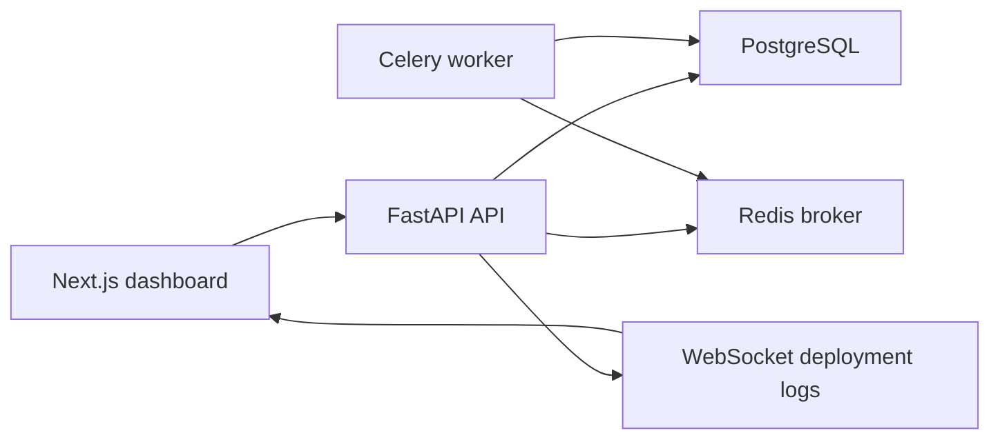
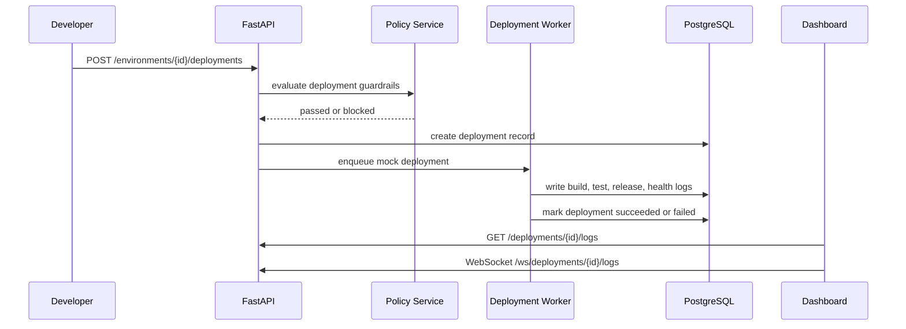

# Internal Deployment Platform

[](https://github.com/SpyloDEV/internal-deployment-platform/actions/workflows/ci.yml)


Internal Deployment Platform is a lead-level fullstack portfolio project that models a small internal version of Vercel, Railway, or Render for engineering teams. It gives developers a control plane to register services, manage environments, configure secrets, trigger mock deployments, inspect live logs, run health checks, rollback releases, review policy guardrails, and investigate incidents.

The project is built to look like a real platform engineering product, not a tutorial app. The backend uses FastAPI, PostgreSQL, SQLAlchemy 2.0, Alembic, Redis, Celery, JWT authentication, service/repository layers, and pytest. The frontend uses Next.js, TypeScript, Tailwind, shadcn-style components, TanStack Query, and Recharts.

## Screenshots

Screenshots are intentionally left as repo-ready placeholders so a portfolio owner can add their own local captures after running the app.

| Dashboard | Service Detail | Deployment Logs |
| --- | --- | --- |
| `docs/screenshots/dashboard.png` | `docs/screenshots/service-detail.png` | `docs/screenshots/deployment-logs.png` |

## Product Capabilities

- JWT authentication with register, login, logout, and current user endpoints.
- Organizations, teams, and role-based permissions for platform owners, admins, developers, and viewers.
- Service registry for frontend, backend, worker, and API services.
- Environments for development, staging, production, and preview releases.
- Mock deployment engine with queued, building, deploying, succeeded, failed, cancelled, and rolled back states.
- Stored deployment logs plus a WebSocket endpoint for realtime deployment log streaming.
- Rollback records linked to a previous successful deployment.
- Environment variables with secret masking and audit trails.
- Health checks with history and automatic service/environment status updates.
- Deployment analytics for success rate, average duration, rollout volume, failures, and rollbacks.
- Policy guardrails for production deploys, staging promotion, ownership, offline services, and secret changes.
- Incident tracking linked to services, environments, and deployments.
- Audit logs for important platform actions.

## Architecture



The backend keeps route handlers thin. Business rules live in services, database access lives in repositories, and SQLAlchemy models are separated from Pydantic schemas.

```text
backend/
  app/
    api/routes/          REST and WebSocket endpoints
    core/                config, security, exceptions, logging
    db/                  async SQLAlchemy session and base metadata
    models/              SQLAlchemy models and enums
    repositories/        database access layer
    schemas/             Pydantic request/response contracts
    services/            business logic and policy checks
    workers/             Celery app and background task entrypoints
    websockets/          connection manager
  alembic/               migrations
  tests/                 pytest suite

frontend/
  app/                   Next.js App Router pages
  components/            dashboard, layout, charts, tables, forms, ui
  hooks/                 TanStack Query hooks
  lib/                   API, auth, websocket, utility helpers
  types/                 shared frontend types
```

## Deployment Flow



## Rollback Flow

1. A user selects a previous successful deployment.
2. The API validates access and rollout state.
3. A rollback deployment record is created with `rollback_source_deployment_id`.
4. Rollback logs and an audit event are stored.
5. Analytics include the rollback in reliability metrics.

## Policy Guardrails

| Policy | Behavior |
| --- | --- |
| Production deploy requires admin | Blocks developers from production releases. |
| Staging success required | Blocks production deploys without a successful staging deployment first. |
| Owner team required | Blocks services without an owner team. |
| Offline service blocked | Blocks deploys while a service is offline. |
| Production env var audit | Emits warnings and audit logs for production changes. |

## API Examples

```bash
curl -X POST http://localhost:8000/api/v1/auth/register \
  -H "Content-Type: application/json" \
  -d '{"email":"platform@example.com","password":"SecurePass123!","full_name":"Platform Owner"}'
```

```bash
curl -X POST http://localhost:8000/api/v1/services \
  -H "Authorization: Bearer <token>" \
  -H "Content-Type: application/json" \
  -d '{
    "organization_id": "<organization_id>",
    "name": "customer-api",
    "repository_url": "https://github.com/acme/customer-api",
    "service_type": "backend",
    "framework": "fastapi",
    "status": "healthy",
    "owner_team": "Core Platform"
  }'
```

```bash
curl -X POST http://localhost:8000/api/v1/environments/<environment_id>/deployments \
  -H "Authorization: Bearer <token>" \
  -H "Content-Type: application/json" \
  -d '{"version":"v2.8.4","commit_sha":"abc123456789"}'
```

Example deployment response:

```json
{
  "id": "dep_123",
  "service_id": "svc_123",
  "environment_id": "env_123",
  "version": "v2.8.4",
  "commit_sha": "abc123456789",
  "branch": "main",
  "status": "succeeded",
  "duration_seconds": 42,
  "rollback_source_deployment_id": null
}
```

WebSocket log stream:

```text
ws://localhost:8000/api/v1/ws/deployments/{deployment_id}/logs?token=<jwt>
```

## Frontend Pages

- `/login`
- `/register`
- `/dashboard`
- `/services`
- `/services/[id]`
- `/services/[id]/environments`
- `/deployments`
- `/deployments/[id]`
- `/analytics`
- `/governance`
- `/audit-logs`
- `/incidents`
- `/settings`

## Local Setup

Backend:

```bash
cd backend
python -m venv .venv
source .venv/bin/activate
pip install -e ".[dev]"
cp ../.env.example ../.env
alembic upgrade head
uvicorn app.main:app --reload
```

Frontend:

```bash
cd frontend
npm install
npm run dev
```

The API docs are available at `http://localhost:8000/docs`.

## Docker Setup

```bash
cp .env.example .env
docker compose up --build
```

Compose starts the backend API, Next.js frontend, PostgreSQL, Redis, and a Celery worker.

## Testing and Quality

```bash
make test
make lint
make migrate
make worker
```

The GitHub Actions workflow runs Ruff, Black, pytest, frontend lint, TypeScript typecheck, and Next.js production build.

## Demo Data

```bash
cd backend
python scripts/seed_demo.py
```

Demo credentials:

```text
Email: platform@example.com
Password: SecurePass123!
```

Seed data includes a demo platform owner, organization, team, services, environments, deployments, deployment logs, masked env vars, health checks, incidents, and audit logs.

## Why This Is Lead-Level

- A real control-plane domain instead of generic CRUD.
- Permission checks at the service layer.
- Policy evaluation before dangerous actions.
- Durable deployment history and rollback records.
- Secret masking and audit logging.
- Background worker boundary for long-running release jobs.
- WebSocket log stream for realtime operations.
- Migration-ready SQLAlchemy schema.
- CI that validates backend and frontend quality gates.

## What This Demonstrates

- FastAPI application structure with clear modules.
- Async SQLAlchemy 2.0 with repository boundaries.
- Alembic migrations for production-style schema management.
- JWT authentication and role-aware access control.
- Dockerized fullstack development with PostgreSQL and Redis.
- Deployment-domain modeling: services, environments, logs, health, policies, rollbacks, incidents.
- Frontend dashboard composition with Next.js, TypeScript, Tailwind, charts, tables, states, and responsive layout.
